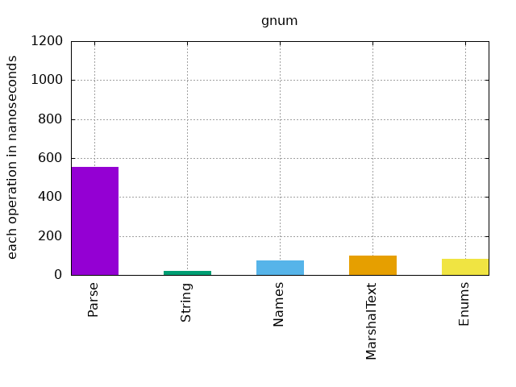
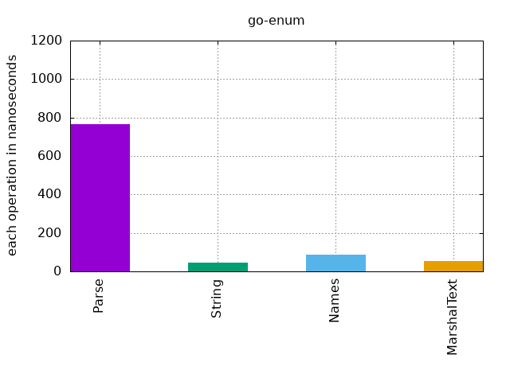
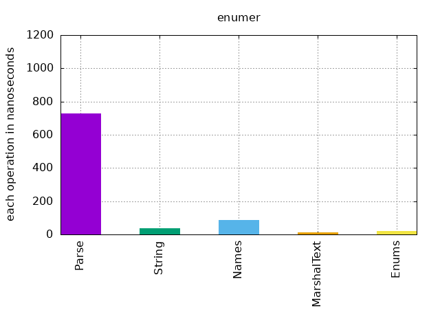

[](https://github.com/joelboim/gnum/tags)


[](https://pkg.go.dev/github.com/joelboim/gnum)
[](https://goreportcard.com/report/github.com/joelboim/gnum)


## Y Use gnum:grey_question:

* No code generation.
* Constant.
* Fast.
* Can be used as generic T.
* Concurrency safe.

## Benchmarks:dash:





## Getting Started

```bash
go get github.com/joelboim/gnum
````

# Example

First lets declare an enum type:

```go
package enums

import "github.com/joelboim/gnum"

type (
	Color = gnum.Enum[struct {
		Red,
		Blue,
		Green color
	}]
	color int
)

const (
	Red Color = iota
	Blue
	Green
)
```

Now we can use it like other languages Enums:

```go 
func main() {
	fmt.Println(Red, Blue, Green) // Red Blue Green

	fmt.Println(gnum.Names[Color]()) // [Red Blue Green]

	fmt.Println(fmt.Sprintf("%T", gnum.Enums[Color]())) // []gnum.Enum[struct { Red main.color; Blue main.color; Green main.color }]

	_, err := gnum.Parse[Color]("red")
	fmt.Println(err) // error

	colorJson, _ := json.Marshal(struct{ Color Color }{Blue})
	fmt.Println(string(colorJson)) // {"Color":"Blue"}
}
```

Can be also used as generic type:

```go
func foo[T gnum.Enumer[T]](enum T) {
	fmt.Println(
		enum.Names(),
		enum.Type())
}

func main() {
    foo(Red)    // [red blue green] color
    foo(Square) // [Square] shape
}
```

If you need to customize elements of the enum you can do it with tags:

```go
type (
	Color = gnum.Enum[struct {
		Red    color
		Blue   color `gnum:"value=3,name=b_l_u_e"`
		Green  color
		Yellow color
	}]
	color int
)
```
